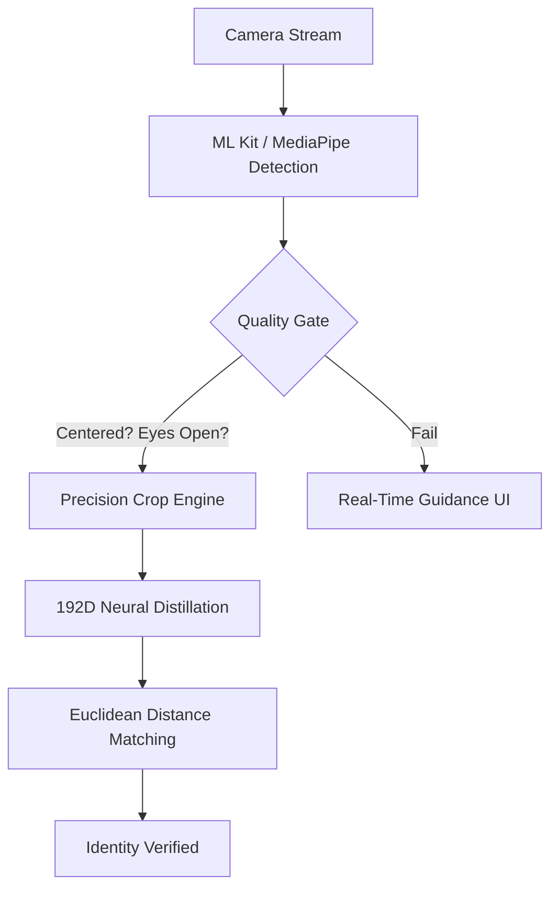

# Face Recognition Kit

[](https://pub.dev/packages/face_recognition_kit)
[](https://opensource.org/licenses/MIT)
[](https://pub.dev/packages/face_recognition_kit)

**Face Recognition Kit** is a high-performance, professional-grade Flutter SDK designed for real-time facial detection and precision biometric identification. Built with a **Crop-First Alignment Engine**, it provides industry-leading accuracy for attendance systems, secure kiosks, and proctoring applications.

---

## 📊 Compatibility Matrix

| Platform | Support | Min. OS Version | Hardware/Feature Requirements |
|:--- |:---:|:---:|:--- |
| **Android** | ✅ | API 21+ (Lollipop) | Camera support, OpenGL ES 3.0+ |
| **iOS** | ✅ | iOS 12.0+ | ARM64 Architecture (Physical device recommended) |
| **Web** | ✅ | Modern Browsers | WASM support, `SharedArrayBuffer` (for MediaPipe) |
| **Flutter** | ✅ | ^3.35.0 | Stable channel recommended |

---

## 🚀 Key Professional Features

*   **192D Biometric Distillation**: High-dimensional vector extraction for lighting-invariant matching.
*   **Precision Alignment Engine**: Intelligent "Crop-then-Rotate" pipeline that eliminates coordinate drift.
*   **Real-Time Enrollment Guidance**: UX-optimized overlays guiding users to "Look Straight" or "Move Closer".
*   **Neural Engine Diagnostics**: Real-time detection of missing AI models with actionable developer warnings.
*   **Unified Multi-Platform API**: Consistent behavior across **Android, iOS, and Web**.
*   **Production-Ready Components**: Pre-built `FaceScannerView` and `RecognitionDialog` for rapid deployment.

---

## 🏗️ Technical Architecture

The SDK uses a multi-stage pipeline to ensure biometric integrity:



---

## 📦 Installation & Setup

### 1. Add Dependency
```yaml
dependencies:
  face_recognition_kit: ^1.2.0
```

### 2. Biometric Model Setup (CRITICAL)
The SDK requires a `mobile_facenet.tflite` model.

1. Create `assets/models/` in your project root.
2. Place your TFLite model file there.
3. Update `pubspec.yaml`:
```yaml
flutter:
  assets:
    - assets/models/mobile_facenet.tflite
```

---

## 🛠️ Implementation Guide

### Basic Scanner Implementation
Deploy a full-featured biometric scanner in minutes.

```dart
FaceScannerView(
  detector: FaceDetectorInterface(),
  recognizer: FaceRecognizerInterface(),
  profiles: myRegistry, // List<FaceProfile>
  enableDefaultDialog: true,
  onFaceRecognized: (profile, image) {
    print("Welcome back, ${profile.name}");
  },
)
```

### Advanced UI Customization
Tailor the recognition experience to your brand.

```dart
FaceScannerView(
  // ... engines ...
  dialogOptions: RecognitionDialogOptions(
    primaryColor: Colors.indigo,
    successTitle: "Access Granted",
    welcomeMessage: "Hello, {name}!",
    displayDuration: Duration(seconds: 3),
  ),
  guidanceOptions: FaceGuidanceOptions(
    enabled: true,
    stayStillMessage: "Analysing biometrics...",
    moveCloserMessage: "Please center your face",
    // Custom UI Overlay Builder
    guidanceBuilder: (context, message) => MyCustomOverlay(text: message),
  ),
)
```

---

## ⚙️ API Reference

### `FaceScannerView`
| Property | Type | Description |
| :--- | :--- | :--- |
| `detector` | `FaceDetectorInterface` | The engine responsible for localizing faces. |
| `recognizer` | `FaceRecognizerInterface` | The engine responsible for biometric extraction. |
| `profiles` | `List<FaceProfile>` | Known identities to match against. |
| `captureOnlyFace` | `bool` | If true, returns only the cropped face image in callbacks. |
| `onFaceDetected` | `Function(FaceData, Uint8List)` | Triggered on every frame a face meets quality standards. |

### `FaceGuidanceOptions`
| Property | Default | Description |
| :--- | :--- | :--- |
| `rotationThreshold` | `15.0` | Maximum allowed head tilt (degrees) for capture. |
| `eyeOpenThreshold` | `0.4` | Minimum probability for eyes to be considered open. |
| `brightnessThreshold` | `40.0` | Minimum average frame brightness required. |

---

## 🏗️ Full Implementation Example

This example shows how to integrate the SDK with a standard identity provider and state management system.

```dart
import 'package:face_recognition_kit/face_recognition_kit.dart';

class BiometricAuthPage extends StatelessWidget {
  @override
  Widget build(BuildContext context) {
    return FaceScannerView(
      detector: FaceDetectorInterface(),
      recognizer: FaceRecognizerInterface(),
      profiles: userStore.allProfiles, // List<FaceProfile> from your backend
      enableDefaultDialog: true,
      captureOnlyFace: true,
      // Customising the UI guidance
      guidanceOptions: FaceGuidanceOptions(
        enabled: true,
        moveCloserMessage: "Align face for verification",
      ),
      // Triggered on successful match
      onFaceRecognized: (profile, image) {
        handleLoginSuccess(profile);
      },
      // Triggered on every valid face detection (useful for enrollment)
      onFaceDetected: (face, image) {
        if (isEnrollmentMode) saveBiometric(face, image);
      },
    );
  }
}
```

---

---

## 💡 Best Practices for 99.9% Accuracy

1.  **Lighting**: Ensure even lighting on the face. Avoid strong backlighting (windows behind the user).
2.  **Distance**: Users should hold the device at a natural arm's length (Face filling ~30% of the frame).
3.  **Registry Hygiene**: Ensure the registered biometric profile is captured in good lighting with an upright head.
4.  **Mirroring**: Use `FaceScannerView` defaults—it automatically handles front-camera mirroring correction.

---

## ✅ Production Checklist

Before publishing your application, ensure the following are met:
- [ ] **Model Asset**: `mobile_facenet.tflite` is placed in `assets/models/`.
- [ ] **Release Mode**: Test the engine in `flutter run --release` for optimal neural performance.
- [ ] **Android Min SDK**: Ensure `minSdkVersion 21` is set in `build.gradle`.
- [ ] **iOS Privacy Keys**: `NSCameraUsageDescription` added to `Info.plist`.
- [ ] **Registry Prep**: Train users to register in stable, front-lit environments for 99.9% consistency.

---

## 🌍 Real-Life Use Cases

*   **Attendance Systems**: Contactless clock-in/out for modern offices and classrooms.
*   **Biometric Security**: Adding identity verification to sensitive app features or financial transactions.
*   **AI Proctoring**: Continuous verification for secure remote examinations.
*   **Personalized Kiosks**: Recognizing and greeting customers at smart retail terminals.

---

## 📄 License
MIT Licensed. Developed for high-security biometric ecosystems.
